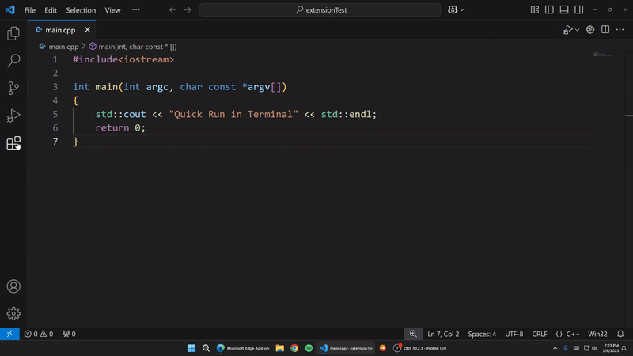

# Quick Run in Terminal

This is a `vscode` extension to run `C`, `C++`, `python`, `Rust`, `java`, `javascript` files in vscode terminal.
It just `cd` into the file directory. then clears the terminal. Then runs the program.

## how to run?

Install this extension.
First open a `C`, `C++`, `python`, `rust`, `java`, `javascript` files. Do one of these following.

1. use shortcut `Ctrl+Alt+C` to run the file
2. right click the Text Editor and then click `Compile and run` in editor context menu
3. click `Quick Run` button in title menu
4. Open `command palette` and search `Quick Run` abd hit enter.

---

## Demo



## Features

- compile and run `C/C++`, `python`, `java`, `rust`, `javascript` by default.
- You can create custom command to build and run.

---

## Requirements

A compiler/interpreter for your favorite language.

> **❗️ Important**: default C/C++ compiler is set to `gcc`/`g++`, For python it is set to `python`. If you want to use different compiler/interpreter see [configurations example](#configurations).

---

## Configurations

### default

```jsonc
{
  // clears the terminal before run.
  "quickRunInTerminal.clearBeforeRun": true,
  // If false saves only active file, otherwise saves all files.
  "quickRunInTerminal.saveAllFilesBeforeRun": false,
  // empty string means name of the program followed by exe/out
  "quickRunInTerminal.binaryOutputName": "",
  // C/C++
  "quickRunInTerminal.C_compilerPath": "gcc",
  "quickRunInTerminal.Cpp_compilerPath": "g++",
  // Python
  "quickRunInTerminal.Python_interpreterPath": "python",
  // Rust
  "quickRunInTerminal.Rust_compilerPath": "rustc",
  // Java
  "quickRunInTerminal.Java_CompilerPath": "javac",
  "quickRunInTerminal.Java_Runtime": "java",
  // JavaScript
  "quickRunInTerminal.JavaScript_interpreterPath": "node"
}
```

Lets say you want to use `python3` instade of `python` as interpreter.

- go to settings.
- search `quick run in terminal`.
- Find the section where says `Quick Run In Terminal: Python_interpreter Path`.
- set that to `python3` as python interpreter.

For `C/C++` find `Quick Run In Terminal: C_compiler Path` or `Quick Run In Terminal: C_compiler Path` to `gcc`/`clang`/`g++`/`cc` or whatever.

### Examples

```json
{
  "quickRunInTerminal.Python_interpreterPath": "/home/user/bin/python3",
  "quickRunInTerminal.Python_interpreterPath": "python3",
  "quickRunInTerminal.Cpp_compilerPath": "/usr/g++",
  "quickRunInTerminal.C_compilerPath": "clang"
}
```

> NOTE: It says `path` but if the program is accessable from anywhere then you can just put program name.

---

## Bugs and Issues

- report bugs/issues here [github issues](https://github.com/AbrarShakhi/quick-run-in-terminal/issues)

## Credits

- <a href="https://www.flaticon.com/free-icons/coding" title="coding icons">Icons created by iconsmind - Flaticon</a>
